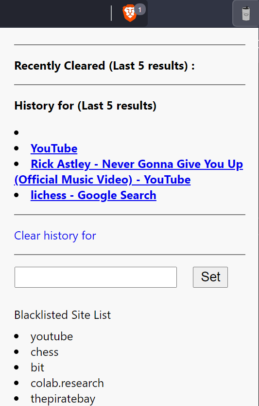

# History deleter

## Pitch

Yes... we all know why we are here. This is a automatic history deleter inspired due to "personal" events. 

## What it does

This extension includes a page action with a popup specified as "popup.html". This popup will display your recent blacklisted pages that have been deleted from your history. The popup shows a list of 5 history entries for the current domain. So... technically what is happening is your last recent 5 visted pages are saved locally in the chrome extension (where nobody but you know) and deleted from your chrome history logs (Alt-h). 

**It removes history based on keywords. For example, if you have the keyword "youtube" then all urls including the word youtube would be deleted from the history even if the website is not youtube.com: https://www.google.com/search?q=youtube&oq=youtube&aqs=chrome..69i57j69i65l2.769j0j1&sourceid=chrome&ie=UTF-8.**
You can specify websites by making the keyword "youtube.com".

## Visual

As we can see, this is quite a crude layout / appearance. However, it is simple and gets the job done. **To add or remove keywords to blacklist sites, write your keyword into the text-bar and click the button "Set". There will be no duplicate values (since it is a Set). If the keyword already exists in the set, the keyword will be removed.

## For nerds: What it shows

How to use the history API.
Please give suggetions on how to improve in the [issues](https://github.com/collinli2022/history-deleter-chrome-extension/issues)
